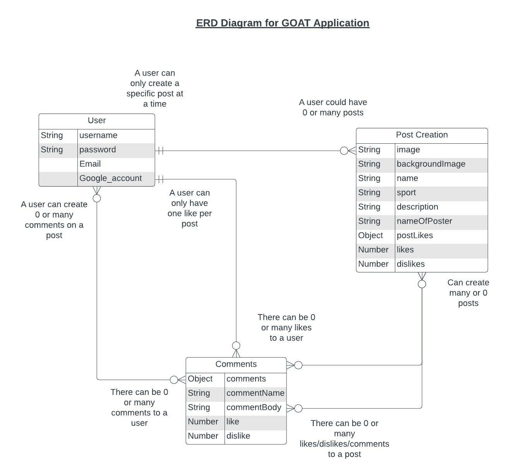
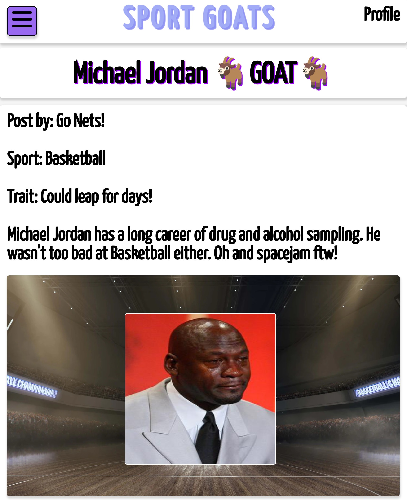

# Sport GOAT's 🐐
A CRUD based application, Sport GOATS is a place where you can post you favorite sports personality and why you think they are the GOAT.
This is a fun place to display your best image of your GOAT including your reasons and have your say on othe users GOATS!
## *Live Link*


## Getting Started
To begin posting, create an account and login in. You will be redirected to the home page where you will have the option to view previous posts, comment and like/dislike. Additionally, you will be able to create your own

To post, you will have to option to:
* Add your name
* Add the sport your GOAT is asssociated with
* Add their most notable trait *example: atheliticm*
* Add and image and background image
* A synopsis explaining the reasons for why they are the GOAT!

Once created, you will be brought to the homepage where your post will be displayed and can be viewed by other users!

## Technologies Used

* JavsScript
* HTML
* CSS
* Express.js
* Node.js
* MongoDB
* Mongoose

## ERD, Wireframes & Kanban Board



*Kanban Board*: https://trello.com/b/OSVDohzv/sports-goats#

## Screenshots
### *Homepage*

### *Homepage Grid*

### *Hamburger Menu*

### *Show Page*



## How the Application Works
### Models Views & Controllers
The applications is separated by the different models schema, view templates and controllers

#### Application Models
A database model is setup to connect the database collection URI to Mongoose

 ``` 
 const mongoose = require('mongoose')

mongoose.connect(process.env.MONGO_URI, {
  useNewUrlParser: true,
  useUnifiedTopology: true
})

module.exports = mongoose.connection 
```

Next, a model for the each GOAT post is created. This will include all the schema attributed mentioned previouly, including a comments array 

## RESTful Routes Table


| Number | Action  | URL             | HTTP Verb     | JSX View Filename | Mongoose Method        | Notes                              |
| -------|:-------:|:---------------:|:-------------:|:-----------------:|:----------------------:|:----------------------------------:|
| 1      | Index   |  /goats/        |  GET          |    Index.jsx      |  Goat.find()           | Will show the main landing page    |
| 2      | Show    |  /goats/:id     |  GET          |    Show.jsx       |  Goat.findById         | Click on a post to display expanded information |                     
| 3      | New     |  /goats/new     |  GET          |    New.jsx        |  N/A                   | A form to enter information for a new GOAT post |
| 4      | Create  |  /goats/        |  POST         |    none           |  Goat.create(req.body) | When a new post has been entered, it will then get posted to the main page|
| 5      | Edit    |  /goats/:id/edit|  GET          |    Edit.jsx       |  Goat.findById         | When the user wants to edit posts, they will be redirected to the edit view template (same as show) so that the info can be edited|
| 6      | Update  |  /goats/:id, /goats/:id/comments, /goats/:id/postLikes|PUT       |none           |Goat.findByIdAndUpdate|Comments on posts and likes on a particular post. NOTE: there are likes/dislikes on comments also| 
| 7      | Destroy |  /goats/:id     |  DELETE       |    none           |  Goat.findByIdAndDelete| Deleting a post. This will also be the same for comments and will be restricted by user|


