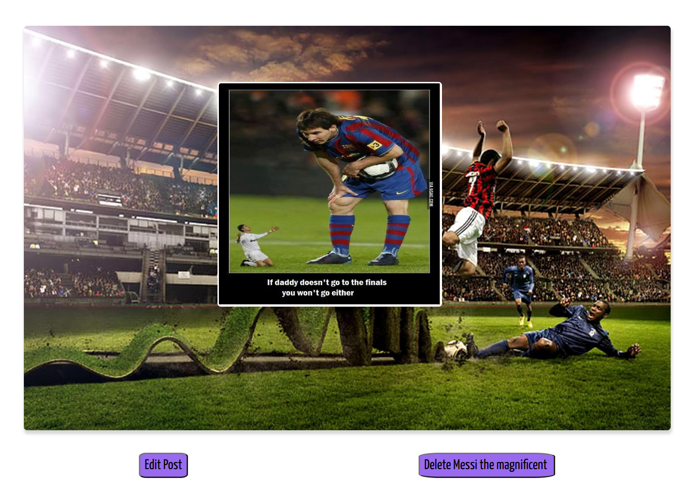

# Sport GOAT's 🐐

## Getting Started

## Technologies Used

## ERD & Wireframes

## Screenshots
### *Homepage*

     

<!-- 

    

 -->

### *Homepage Flex-Grid*

<picture>
  <source media="(prefers-color-scheme: dark)" srcset="images/homepage-grid.png">
  <source media="(prefers-color-scheme: light)" srcset="images/homepage-grid.png">
  
</picture>
### *Hamburger Menu*

### *Show Page*

## RESTful Routes Table

| Number | Action  | URL            | HTTP Verb     | JSX View Filename | Mongoose Method   |
| -------|:-------:|:--------------:|:-------------:|:-----------------:|:-----------------:|
| 1      | Index   |  /goats/        |  GET          |    Index.jsx      |  Goat.find()       |
| 2      | Show    |  /goats/:id     |  GET          |    Show.jsx       |  Goat.findById     |
| 3      | New     |  /goats/new     |  GET          |    New.jsx        |  N/A              |
| 4      | Create  |  /goats/        |  POST         |    none           |  Goat.create(req.body)|
| 5      | Edit    |  /goats/:id/edit|  GET          |    Edit.jsx       |  Goat.findById     |
| 6      | Update  |  /Goats/:id     |  PUT          |    none           |  Goat.findByIdAndUpdate|
| 7      | Destroy |  /goats/:id     |  DELETE       |    none           |  Goat.findByIdAndDelete|

