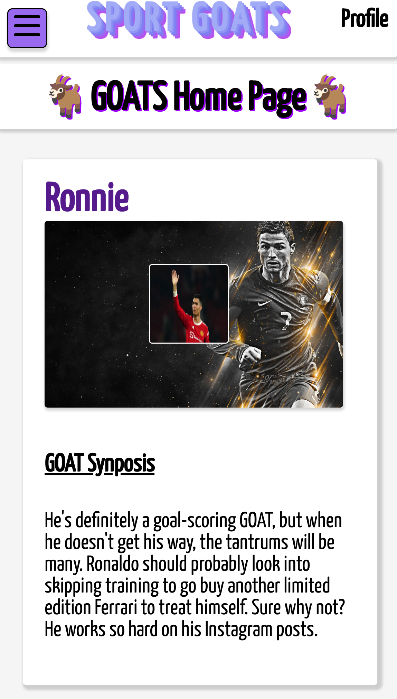

# Sport GOAT's 🐐

## Getting Started

## Technologies Used

## ERD & Wireframes

## Screenshots
### *Homepage*

     

<!-- 

    

 -->

### *Homepage Flex-Grid*

### *Hamburger Menu*

### *Show Page*

## RESTful Routes Table

| Number | Action  | URL             | HTTP Verb     | JSX View Filename | Mongoose Method        | Notes                              |
| -------|:-------:|:---------------:|:-------------:|:-----------------:|:----------------------:|:----------------------------------:|
| 1      | Index   |  /goats/        |  GET          |    Index.jsx      |  Goat.find()           | Will show the main landing page    |
| 2      | Show    |  /goats/:id     |  GET          |    Show.jsx       |  Goat.findById         | Click on a post to display expanded information |                     
| 3      | New     |  /goats/new     |  GET          |    New.jsx        |  N/A                   | A form to enter information for a new GOAT post |
| 4      | Create  |  /goats/        |  POST         |    none           |  Goat.create(req.body) | When a new post has been entered, it will then get posted to the main page|
| 5      | Edit    |  /goats/:id/edit|  GET          |    Edit.jsx       |  Goat.findById         | When the user wants to edit posts, they will be redirected to the edit view template (same as show) so that the info can be edited|
| 6      | Update  |  /goats/:id,  
                    /goats/:id/comments, 
                    /goats/:id/postLikes|  PUT       |    none           |  Goat.findByIdAndUpdate| Comments on posts and likes on a particular post. NOTE: there are likes/dislikes on comments also|
| 7      | Destroy |  /goats/:id     |  DELETE       |    none           |  Goat.findByIdAndDelete| Deleting a post. This will also be the same for comments and will be restricted by user|

