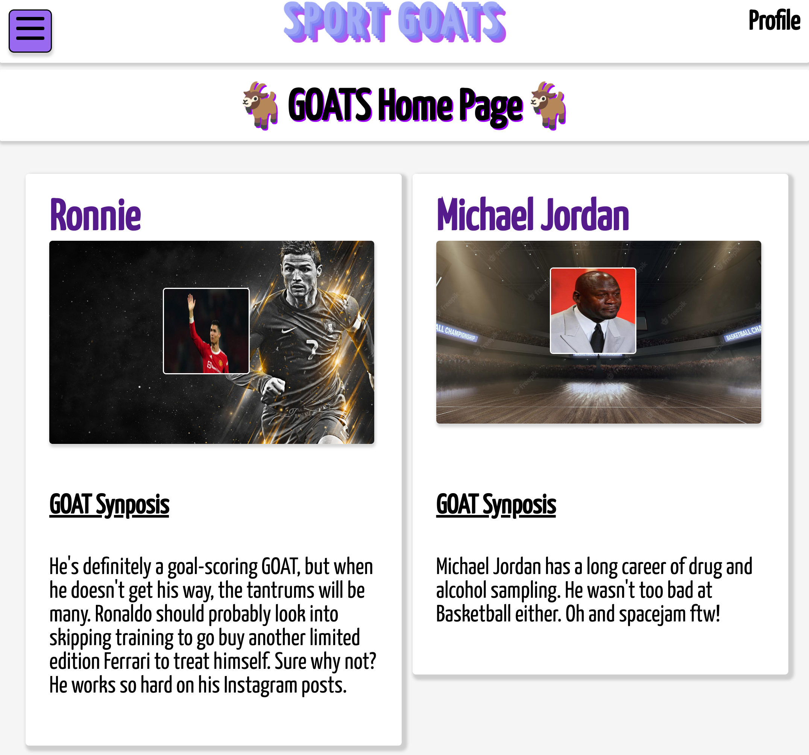
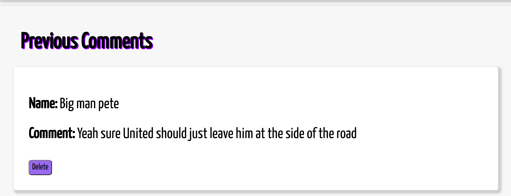
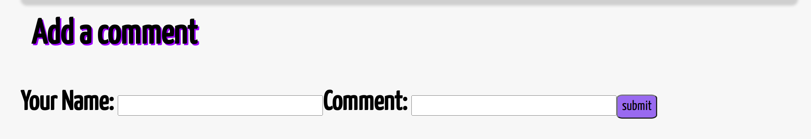
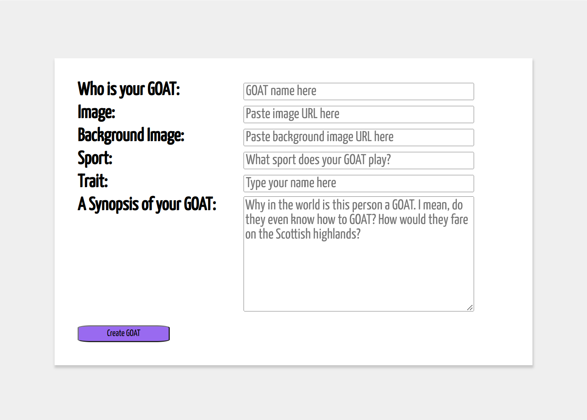

# Sport GOAT's 🐐
A CRUD based application, Sport GOATS is a place where you can post you favorite sports personality and why you think they are the GOAT.
This is a fun place to display your best image of your GOAT including your reasons and have your say on othe users GOATS!

## *Live Link*

## Getting Started
To begin posting, create an account and login in. You will be redirected to the home page where you will have the option to view previous posts, comment and like/dislike. Additionally, you will be able to create your own

To post, you will have to option to:
* Add your name
* Add the sport your GOAT is asssociated with
* Add their most notable trait *example: atheliticism*
* Add and image and background image
* Add a synopsis explaining the reasons for why they are the GOAT!

Once created, you will be brought to the homepage where your post will be displayed and can be viewed by other users!

## Technologies Used

* JavsScript
* HTML
* CSS
* Express.js
* Node.js
* MongoDB
* Mongoose
* React

## ERD, Wireframes & Kanban Board
### *ERD Diagram*


### *Wireframe Diagram*


*Kanban Board*: https://trello.com/b/OSVDohzv/sports-goats#

## Screenshots
### *Homepage*

*Figure 1: Main Homepage*

### *Homepage Grid*

*Figure 2: Main Homepage*

### *Hamburger Menu*

*Figure 3: Hamburger Menu Dropdown*

### *Show Page*

*Figure 4: Post Show Page Details*
<br><br />


*Figure 5: Post Show Page Image/Background*
<br />


*Figure 6: Post Show Page Likes/Dislikes Section*
<br />


*Figure 7: Post Show Page Previous Comments Display*
<br />


*Figure 8: Post Show Page Comments Display*
<br />


*Figure 9: Create a new GOAT page*
<br />

## How the Application Works
### Models Views & Controllers
The applications is separated by the different models schema, view templates and controllers

#### Application Models
A database model is setup to connect the database collection URI to Mongoose. Code blocks for each models are shown here to guide the reader to how the data is passed into the application.

 ``` 
 const mongoose = require('mongoose')

mongoose.connect(process.env.MONGO_URI, {
  useNewUrlParser: true,
  useUnifiedTopology: true
})

module.exports = mongoose.connection 
```

To test that the database is recieving the information based on the `goat.js` model schema (explained below), we run a `seed.js`. This is then checked on the corresponding collection within MongoDB.

```
require('dotenv').config()
const db = require('./db')
const Goat = require('./goat.js')

db.on('open', () => {
  const starterGoats = [
    {
      image: 'test.jpg',
      backgroundImage: 'test.jpg',
      name: 'peter the great',
      trait: 'fantastic physique',
      sport: 'soccer',
      description: 'the greatest soccer player of all time by a long shot. In fact, thats what this player is known for, epic long shots of the ball',
      nameOfPoster: 'jack in the box',
      comments: [{
        commentName: 'Johnny the Maestro',
        commentBody: 'I would tend to agree with this statement, simple FACTS!',
        like: 40,
        dislike: 22
      }]
    },
    {
      image: 'test.jpg',
      backgroundImage: 'test.jpg',
      name: 'cristy ronaldo',
      trait: 'unbelievable athleticism',
      sport: 'football',
      description: 'Really really good player when hes not 37 and crying about being on the bench',
      nameOfPoster: 'Ronnie the man',
      comments: [{
        commentName: 'A big RON fan',
        commentBody: 'RON is the GOAT, FACT!!',
        like: 5334,
        dislike: 1002
      }]
    }
  ]

  Goat.deleteMany({}) // <-- empties the database
    .then(() => {
      Goat.create(starterGoats)
        .then((createdGoats) => {
          console.log('all the created GOATS: ', createdGoats)
          db.close()
        })
        .catch((error) => {
          console.log(error)
          db.close()
        })
    })
    .catch((error) => {
      console.log(error)
      db.close()
    })
})

```

Next, a model for the each GOAT post is created. This will include all the schema attributed mentioned previouly, including a `comments` and `postLikes` objects 

``` 
const mongoose = require('mongoose')

// Create schema for GOAT post
const goatSchema = new mongoose.Schema({
  image: { type: String, required: true },
  backgroundImage: { type: String, required: true },
  name: { type: String, required: true },
  trait: { type: String, required: true },
  sport: { type: String, required: true },
  description: { type: String, required: true },
  nameOfPoster: { type: String, required: true, timestamps: true },
  postLikes: [{
    likes: { type: Number, required: true },
    dislikes: { type: Number, required: true }
  }],
  comments: [{
    commentName: { type: String, required: true },
    commentBody: { type: String, required: true },
    like: { type: Number, required: true },
    dislike: { type: Number, required: true }
  }]
},
{ timestamps: true }
)

const Goat = mongoose.model('Goat', goatSchema)

module.exports = Goat
```

A user model is also created with a password and an array of all the comments created for each post and any likes or dislikes

```
// --- IMPORT DEPENDENCIES ---//
const mongoose = require('mongoose')

// --- DEFINE MODEL ---//
// pull schema and model from mongoose
const { Schema, model } = mongoose

// make goats schema
const userSchema = new Schema({
  username: { type: String, required: true, unique: true },
  password: { type: String, required: true }
})

// make goats model
const User = model('User', userSchema)

module.exports = User
```

#### Views
Using React, a number of different view templates are created. For the main page, an index of all the posts is displayed for the user to interact with. The navigation bar at the top is a part of a defualt desplay, along with the different page header. See *figure 1* thru *figure 8* for where at the top shows the navigation and corresponding header.

The views for each page displayed to the user:

* `Index.jsx` - React view template displaying all previously created GOAT posts (see *figure 1*)
* `New.jsx` - React view template for creating a new GOAT (see *figure 9*)
* `Edit.jsx` - React view template that is modeled exactly as the `New.jsx`. The information from the previously created post is pulled into this template so that it can be edited
* `Show.jsx` React view template for displaying all the post information as selected by the user. It contains comments array and all posted likes and dislikes.
 
#### Controllers
To control the flow of data, a separate folder containing the `authController.js`, `dataController.js`, `routeController.js` and `viewController.js`

To note, the `server.js` contains the Express middleware connection between the `/goats` url and the `routeController.js`. This is also the case for the `/user`.

Of particular interest to the reader is the the `authController.js`. There, where creating a new user, a password is encrypted(hashed and salted) with the help of the `bcrpytjs` npm package.

```
router.post('/signup', async (req, res) => {
  // encrypt password
  req.body.password = await bcrypt.hash(
    req.body.password,
    await bcrypt.genSalt(10)
  )
  // create a new user
  User.create(req.body)
    .then((user) => {
      // redirect to home page
      res.redirect('/user/login')
    })
    .catch((error) => {
      // send error as json
      console.log(error)
      res.json({ error })
    })
})
```
`findOne` Mongoose method is used to find the username based on login and password information provided. 

### CRUD Operations
#### Create
The information entered by the user when creating a new goat is stored in `req` and given parameter name `createdGoat`

`Goat` models the `req` data from the use and stores it in the database via the the `.create` Mongoose method: 

This will then be stored in local data
```
// Create
  create (req, res, next) {
    Goat.create(req.body, (err, createdGoat) => {
      if (err) {
        res.status(400).send({
          msg: err.message
        })
      } else {
        res.locals.data.goat = createdGoat
        next()
      }
    })
  },
```
#### Read
When a user clicks on a post, `.findById` will search the database for a document referenced by its unique id, `req.params.id`, and is stored locally to be passed into the `Show.jsx` template for rendering.
```
 show (req, res, next) {
    Goat.findById(req.params.id, (err, foundGoat) => {
      if (err) {
        res.status(404).send({
          msg: err.message,
          output: 'Could not find a goat with that ID'
        })
      } else {
        res.locals.data.goat = foundGoat
        next()
      }
    })
  }
}
```
#### Update
A post is first edited by finding the corresponding post from the databse by `req.params.id`: its unique id. 

```
 // Edit
  // Show
  show (req, res, next) {
    Goat.findById(req.params.id, (err, foundGoat) => {
      if (err) {
        res.status(404).send({
          msg: err.message,
          output: 'Could not find a goat with that ID'
        })
      } else {
        res.locals.data.goat = foundGoat
        next()
      }
    })
  }
}
```

The post is then updated using `.findByIdAndUpdate` Mongoose method. Essentially, this is similar to the `.findById` but with the added `req.body` where the new information in the body of the post is then updated.

Below shows the same function used for updating comments for each post once a new one is added.

```
  // Update
  update (req, res, next) {
    Goat.findByIdAndUpdate(req.params.id, req.body, { new: true }, (err, updatedGoat) => {
      if (err) {
        res.status(400).send({
          msg: err.message
        })
      } else {
        res.locals.data.goat = updatedGoat
        next()
      }
    })
  },
  updateComment (req, res, next) {
    Goat.findById(req.params.id, (err, foundGoat) => {
      if (err) {
        res.status(400).send({
          msg: err.message
        })
      } else {
        foundGoat.comments.push(req.body)

        Goat.findByIdAndUpdate(req.params.id, foundGoat, { new: true }, (err, updatedGoat) => {
          if (err) {
            res.status(400).send({
              msg: err.message
            })
          } else {
            res.locals.data.goat = updatedGoat
            next()
          }
        })
      }
    })
  },
```
#### Destroy
Destroy will use the Mongoose method `.findByIdAndDelete` the find the post by its unique id (same as the previous methods) and delete as determined by the user.

```
 // Destroy
  destroy (req, res, next) {
    Goat.findByIdAndDelete(req.params.id, (err, deletedGoat) => {
      if (err) {
        res.status(400).send({
          msg: err.message
        })
      } else {
        res.locals.data.goat = deletedGoat
        next()
      }
    })
  },
```
## Future Icebox Adapations
There are a long list of items that could be added here, but thats the what happens when an over active mind gets, well, over active!

Here are the items that would be at the front of the list:
* Add OAuth login
* Add likes/dislikes onto each individual comment
* 

## RESTful Routes Table

| Number | Action  | URL             | HTTP Verb     | JSX View Filename | Mongoose Method        | Notes                              |
| -------|:-------:|:---------------:|:-------------:|:-----------------:|:----------------------:|:----------------------------------:|
| 1      | Index   |  /goats/        |  GET          |    Index.jsx      |  Goat.find()           | Will show the main landing page    |
| 2      | Show    |  /goats/:id     |  GET          |    Show.jsx       |  Goat.findById         | Click on a post to display expanded information |                     
| 3      | New     |  /goats/new     |  GET          |    New.jsx        |  N/A                   | A form to enter information for a new GOAT post |
| 4      | Create  |  /goats/        |  POST         |    none           |  Goat.create(req.body) | When a new post has been entered, it will then get posted to the main page|
| 5      | Edit    |  /goats/:id/edit|  GET          |    Edit.jsx       |  Goat.findById         | When the user wants to edit posts, they will be redirected to the edit view template (same as show) so that the info can be edited|
| 6      | Update  |  /goats/:id, /goats/:id/comments, /goats/:id/postLikes|PUT       |none           |Goat.findByIdAndUpdate|Comments on posts and likes on a particular post. NOTE: there are likes/dislikes on comments also| 
| 7      | Destroy |  /goats/:id     |  DELETE       |    none           |  Goat.findByIdAndDelete| Deleting a post. This will also be the same for comments and will be restricted by user|


